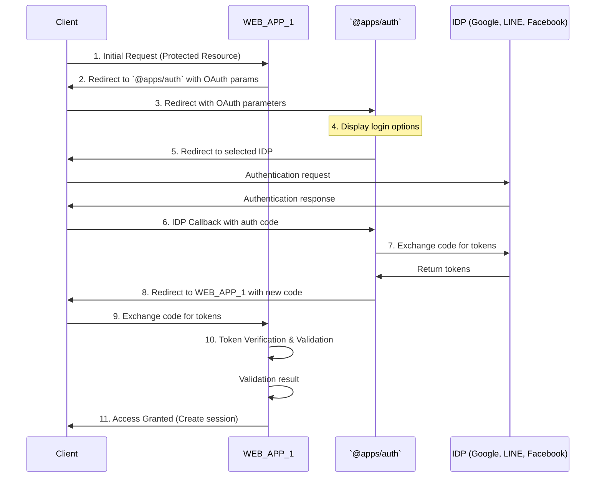
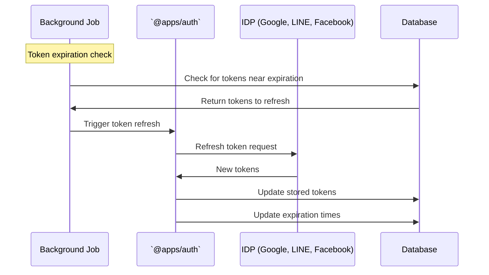
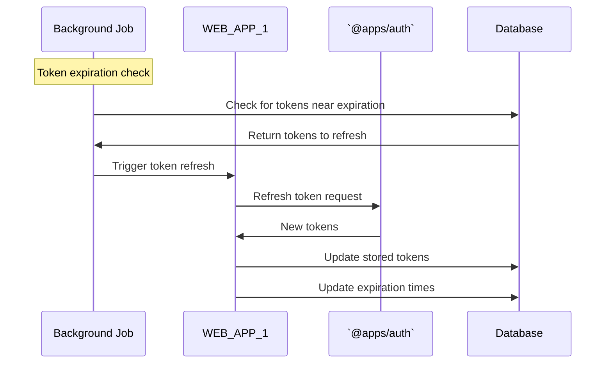

# OAuth/OIDC Implementation Guide: Token Broker Pattern

This document provides a detailed walkthrough of implementing a Token Broker authorization flow, where an `@apps/auth` mediates between external Identity Providers (IDPs) and your web applications. This architecture centralizes authentication logic and provides a single sign-on experience across multiple applications.

## System Architecture Overview



## Complete Flow with Parameters and Database Operations

### Phase 1: Initial Access & Redirection to `@apps/auth`

#### Step 1: CLIENT accesses WEB_APP_1 (protected resource)

- **Action**: User attempts to access a protected page on WEB_APP_1
- **Parameters**: None (initial HTTP request)
- **Security Consideration**: WEB_APP_1 checks for valid session cookie or token

#### Step 2: WEB_APP_1 redirects to `@apps/auth`

- **Action**: WEB_APP_1 generates redirect to `@apps/auth` with OAuth parameters
- **Parameters**:
    - `client_id`: WEB_APP_1's identifier registered with `@apps/auth`
    - `redirect_uri`: URL to redirect back to WEB_APP_1 (whitelisted)
    - `response_type`: "code" (for Authorization Code flow)
    - `scope`: "openid profile email" (depends on required info)
    - `state`: Random secure string to prevent CSRF attacks
    - `code_challenge`: SHA256 hash of a random `code_verifier` (PKCE)
    - `code_challenge_method`: "S256" (SHA256 algorithm)
    - `nonce`: Random string to prevent replay attacks
    - `original_url`: (Optional) URL user was trying to access (for later redirect)
- **Database Operations**:
    - WEB_APP_1 stores the `state`, `code_verifier`, and `nonce` in a temporary session or database with short expiry (typically 10 minutes)
    - **WHY**: To validate the response and complete PKCE flow later

### Phase 2: User Authentication with External IDP

#### Step 3: CLIENT is redirected to `@apps/auth`

- **Action**: Browser redirects to `@apps/auth` login page
- **Parameters**: All parameters from Step 2
- **Security Consideration**: Use HTTPS for all redirects

#### Step 4: `@apps/auth` displays login options

- **Action**: `@apps/auth` presents login methods (LINE, Google, Facebook, etc.)
- **Database Operations**:
    - `@apps/auth` stores the received parameters temporarily
    - **WHY**: To associate the external IDP authentication with the original request

#### Step 5: USER selects an IDP and `@apps/auth` redirects to that IDP

- **Action**: `@apps/auth` generates OAuth request to selected IDP
- **Parameters**:
    - `client_id`: `@apps/auth`'s identifier registered with the IDP
    - `redirect_uri`: `@apps/auth`'s callback URL
    - `response_type`: "code"
    - `scope`: "openid profile email" (adjust based on IDP and required info)
    - `state`: New random secure string
    - `code_challenge`: New SHA256 hash of a new random `code_verifier` (PKCE for `@apps/auth` to IDP flow)
    - `code_challenge_method`: "S256"
    - `nonce`: New random string
- **Database Operations**:
    - `@apps/auth` stores:
        1. The original request parameters from WEB_APP_1
        2. The new `state`, `code_verifier`, and `nonce` for the IDP request
        3. Mapping between these two sets of data
    - **WHY**: To track the relationship between original app request and IDP auth

#### Step 6: USER authenticates with IDP and is redirected back to `@apps/auth`

- **Action**: User logs into IDP and authorizes the requested scopes
- **Parameters returned to `@apps/auth`**:
    - `code`: Authorization code from IDP
    - `state`: Same state sent in Step 5
- **Security Consideration**: Verify the returned `state` matches what was sent

#### Step 7: `@apps/auth` exchanges code for tokens with IDP

- **Action**: `@apps/auth` makes server-to-server request to IDP token endpoint
- **Parameters**:
    - `grant_type`: "authorization_code"
    - `code`: Authorization code received in Step 6
    - `redirect_uri`: Same redirect_uri from Step 5
    - `client_id`: `@apps/auth`'s identifier with the IDP
    - `client_secret`: `@apps/auth`'s secret (if applicable)
    - `code_verifier`: Original plain text value that was hashed in Step 5
- **Response from IDP**:
    - `access_token`: For accessing IDP resources
    - `id_token`: Contains user identity information (JWT)
    - `refresh_token`: For obtaining new tokens
    - `expires_in`: Validity period in seconds
- **Security Consideration**: Validate the `id_token` signature and claims

#### Step 8: `@apps/auth` redirects back to WEB_APP_1

- **Action**: After processing IDP tokens, `@apps/auth` redirects to WEB_APP_1
- **Parameters**:
    - `code`: New authorization code generated by `@apps/auth`
    - `state`: Original state from Step 2
- **Database Operations**:
    - `@apps/auth` stores:
        1. IDP tokens (access, id, refresh) in an encrypted format
        2. User information extracted from ID token
        3. Association with newly generated code
        4. Expiration times for all tokens
    - **WHY**: `@apps/auth` acts as token broker, storing external tokens securely
- **Security Considerations**:
    - Store tokens in encrypted format
    - Set appropriate expiry times
    - Store only necessary user data

### Phase 3: Token Exchange with WEB_APP_1

#### Step 9: WEB_APP_1 exchanges code for tokens with `@apps/auth`

- **Action**: WEB_APP_1 makes server-to-server request to `@apps/auth` token endpoint
- **Parameters**:
    - `grant_type`: "authorization_code"
    - `code`: Code received in Step 8
    - `redirect_uri`: Same as Step 2
    - `client_id`: WEB_APP_1's identifier
    - `client_secret`: WEB_APP_1's secret (if applicable)
    - `code_verifier`: Original plain text from Step 2
- **Response from `@apps/auth`**:
    - `access_token`: For accessing `@apps/auth` resources
    - `id_token`: Contains user identity (JWT)
    - `refresh_token`: For obtaining new tokens
    - `expires_in`: Validity period in seconds
- **Database Operations**:
    - `@apps/auth` records the token issuance with:
        1. Token identifiers (not the tokens themselves)
        2. Association with user
        3. Client application identifier
        4. Scope of access granted
        5. Expiration information
    - **WHY**: For audit trail and token revocation capability

#### Step 10: WEB_APP_1 validates tokens

- **Action**: WEB_APP_1 validates the tokens received from `@apps/auth`
- **Validation Steps**:
    1. Verify `id_token` signature
    2. Validate claims (`iss`, `aud`, `exp`, `iat`, `nonce`)
    3. Extract user information
- **Database Operations**:
    - WEB_APP_1 stores:
        1. Tokens (securely encrypted)
        2. User information
        3. Session expiration
    - **WHY**: To maintain user session and refresh tokens when needed

#### Step 11: WEB_APP_1 creates session and grants access

- **Action**: WEB_APP_1 creates authenticated session and redirects to original URL
- **Parameters**:
    - Application session cookie or token
- **Database Operations**:
    - WEB_APP_1 updates user session information
    - Links session to stored tokens
    - **WHY**: To track active sessions and handle token refreshes

## Token Refresh Processes

### `@apps/auth` Refreshing IDP Tokens



- **Trigger**: When IDP tokens approach expiration
- **Action**: Use stored refresh token to obtain new tokens from IDP
- **Parameters**:
    - `grant_type`: "refresh_token"
    - `refresh_token`: Stored refresh token for the IDP
    - `client_id`: `@apps/auth`'s identifier with the IDP
    - `client_secret`: If required by IDP
- **Database Operations**:
    - Update stored tokens
    - Update expiration times
    - **WHY**: Maintain valid tokens without requiring user re-authentication

### WEB_APP_1 Refreshing `@apps/auth` Tokens



- **Trigger**: When `@apps/auth` tokens approach expiration
- **Action**: Use stored refresh token to obtain new tokens from `@apps/auth`
- **Parameters**:
    - `grant_type`: "refresh_token"
    - `refresh_token`: Stored refresh token
    - `client_id`: WEB_APP_1's identifier
    - `client_secret`: If required
- **Database Operations**:
    - Update stored tokens
    - Update expiration times
    - **WHY**: Maintain valid tokens without disrupting user experience

## Database Schema Recommendations

### `@apps/auth` Database

#### Users Table

```sql
CREATE TABLE users (
  user_id VARCHAR(36) PRIMARY KEY,
  email VARCHAR(255) UNIQUE,
  name VARCHAR(255),
  picture VARCHAR(512),
  created_at TIMESTAMP DEFAULT CURRENT_TIMESTAMP,
  updated_at TIMESTAMP DEFAULT CURRENT_TIMESTAMP
);
```

#### External Identities Table

```sql
CREATE TABLE external_identities (
  identity_id VARCHAR(36) PRIMARY KEY,
  user_id VARCHAR(36) REFERENCES users(user_id),
  provider VARCHAR(50), -- "google", "line", "facebook"
  provider_user_id VARCHAR(255),
  email VARCHAR(255),
  access_token TEXT ENCRYPTED,
  refresh_token TEXT ENCRYPTED,
  id_token TEXT ENCRYPTED,
  access_token_expires_at TIMESTAMP,
  created_at TIMESTAMP DEFAULT CURRENT_TIMESTAMP,
  updated_at TIMESTAMP DEFAULT CURRENT_TIMESTAMP,
  UNIQUE(provider, provider_user_id)
);
```

#### Authorization Codes Table

```sql
CREATE TABLE authorization_codes (
  code VARCHAR(100) PRIMARY KEY,
  user_id VARCHAR(36) REFERENCES users(user_id),
  client_id VARCHAR(36),
  redirect_uri TEXT,
  scope VARCHAR(255),
  nonce VARCHAR(100),
  code_challenge VARCHAR(128),
  code_challenge_method VARCHAR(10),
  expires_at TIMESTAMP,
  created_at TIMESTAMP DEFAULT CURRENT_TIMESTAMP
);
```

#### Tokens Table

```sql
CREATE TABLE tokens (
  token_id VARCHAR(36) PRIMARY KEY,
  user_id VARCHAR(36) REFERENCES users(user_id),
  client_id VARCHAR(36),
  access_token TEXT ENCRYPTED,
  refresh_token TEXT ENCRYPTED,
  id_token TEXT ENCRYPTED,
  scope VARCHAR(255),
  access_token_expires_at TIMESTAMP,
  refresh_token_expires_at TIMESTAMP,
  created_at TIMESTAMP DEFAULT CURRENT_TIMESTAMP,
  updated_at TIMESTAMP DEFAULT CURRENT_TIMESTAMP
);
```

### WEB_APP_1 Database

#### User Sessions Table

```sql
CREATE TABLE user_sessions (
  session_id VARCHAR(36) PRIMARY KEY,
  user_id VARCHAR(36),
  access_token TEXT ENCRYPTED,
  refresh_token TEXT ENCRYPTED,
  id_token TEXT ENCRYPTED,
  user_info JSON,
  access_token_expires_at TIMESTAMP,
  refresh_token_expires_at TIMESTAMP,
  created_at TIMESTAMP DEFAULT CURRENT_TIMESTAMP,
  updated_at TIMESTAMP DEFAULT CURRENT_TIMESTAMP
);
```

## Security Considerations

### PKCE Necessity

PKCE is necessary in two places:

1. **Between `@apps/auth` and IDP**:
    
    - **WHY**: Prevents authorization code interception attacks
    - **Implementation**: `@apps/auth` generates code_verifier and code_challenge
2. **Between WEB_APP_1 and `@apps/auth`**:
    
    - **WHY**: Provides the same protection for your internal authorization flow
    - **Implementation**: WEB_APP_1 generates its own code_verifier and code_challenge

### Token Storage

- **Never store tokens in browser localStorage or sessionStorage**
- **Refresh tokens** must be stored securely in server-side database with encryption
- **Access tokens** can be stored in:
    - HttpOnly, Secure cookies (preferred for web applications)
    - Server-side session store
- **ID tokens** should be stored server-side and only necessary claims sent to frontend

### Session Management

- Implement session inactivity timeouts
- Provide option for users to view and terminate active sessions
- Implement proper session invalidation on logout

### Token Validation

- Always validate token signatures
- Verify all standard JWT claims (iss, aud, exp, iat, etc.)
- For ID tokens, validate the nonce claim to prevent replay attacks

## Implementation Tips

### Handling Token Expiration

1. **Proactive Renewal**:
    
    - Set up a background job to refresh tokens before they expire
    - Typically refresh when 75% of the lifetime has elapsed
2. **On-Demand Renewal**:
    
    - When an API call fails with 401, attempt token refresh
    - Retry the original request with the new token

### Error Handling

- Implement robust error handling for token exchange failures
- Have fallback mechanisms for temporary IDP outages
- Provide clear error messages to users when authentication fails

### Logging and Monitoring

- Log authentication events for security auditing
- Monitor token usage patterns for anomalies
- Track failed authentication attempts

## FAQ for Implementation

1. **Why use a separate `@apps/auth` instead of direct IDP integration?**
    
    - Centralizes authentication logic
    - Provides consistent user experience
    - Simplifies adding/removing identity providers
    - Enables single sign-on across multiple applications
2. **How to handle token revocation?**
    
    - Implement endpoint to revoke tokens
    - On logout, revoke both `@apps/auth` tokens and IDP tokens if possible
    - Update database to mark tokens as revoked
3. **What happens if an IDP is temporarily unavailable?**
    
    - Implement circuit breaker pattern
    - Provide alternative login methods
    - Consider caching user identity information for limited offline access

